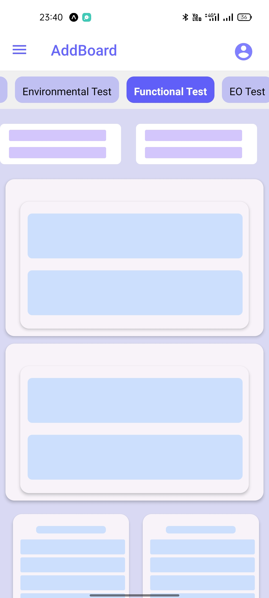
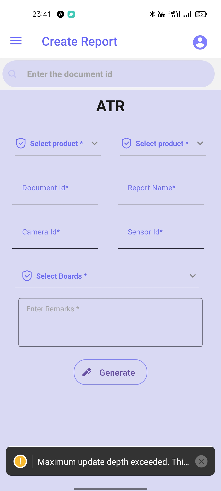
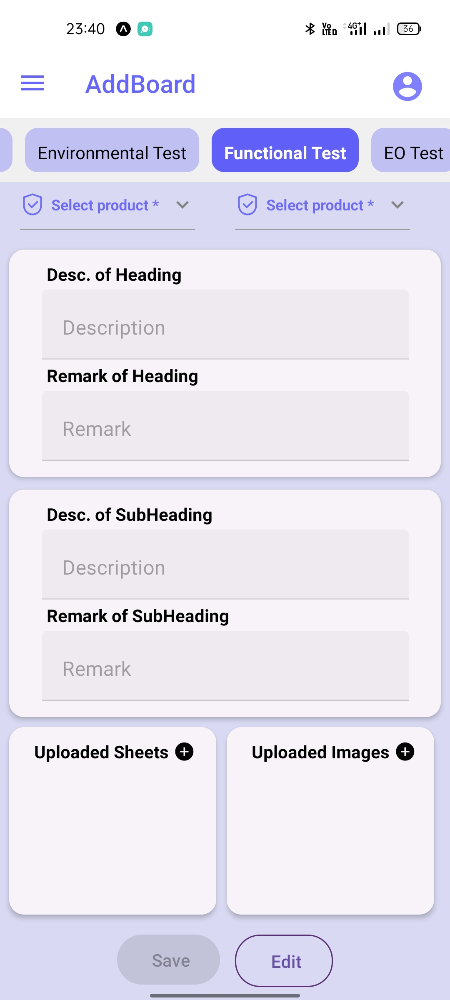
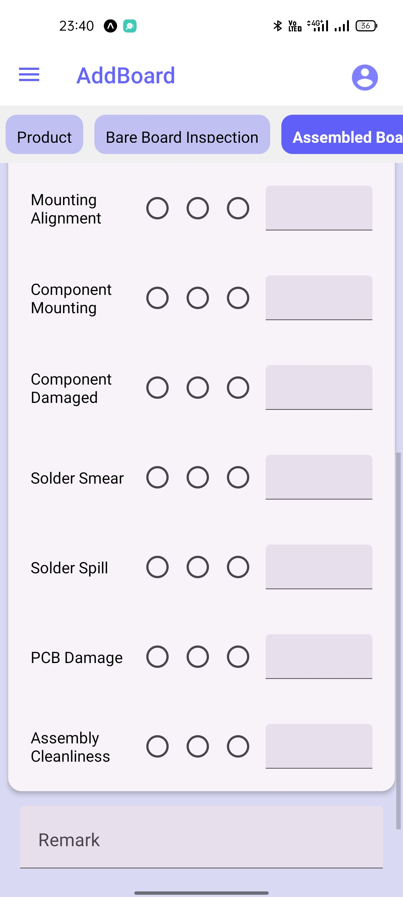

# NativeBase Expo Template

this is a mobile application using expo with native-base template.

The official NativeBase template for [Expo](https://docs.expo.io/)

<div style="display:flex;flex-direction:row;gap:5px;margin-top:20px">
  <div>
    
  </div>
  <div>
    
  </div>
</div>
<div style="display:flex;flex-direction:row;gap:5px;margin-top:20px">
  <div>
    
  </div>
  <div>
    
  </div>
</div>
<div style="display:flex;flex-direction:row;gap:5px;margin-top:20px">
  <div>
    
  </div> 
</div>

## Usage

```sh
expo init my-app --template @native-base/expo-template
```


